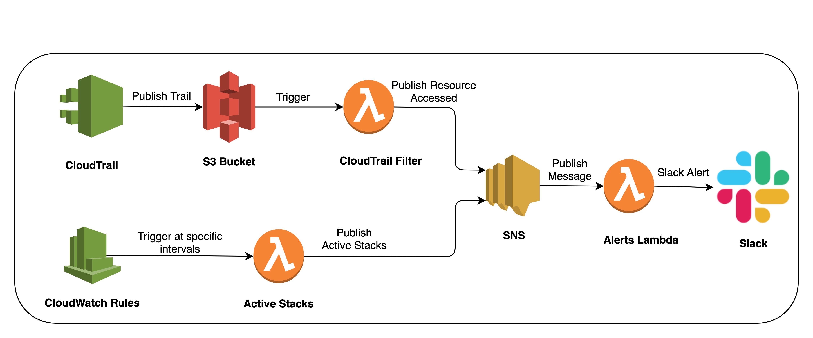

# Introduction
These serverless stacks helps you monitor active cloudformation stacks and restricted resources access. This stack will cost you **negligible or $0.00/month with huge benefits with costs and AWS account security**. For security compliance, the most important thing is to protect the secure resources such as database passwords, KMS keys, Security Groups for service access, etc. Checking CloudTrail logs manually or setting them up for alerting is always a cumbersome and time consuming task. Also, for cost saving purposes, many organisations kill the non-production environments during the non-office hours or over the weekends. For some reasons, if these stacks are active over this idle period, infrastructure engineers needs an alerting so that they can take down those environments to save the costs on AWS cloud.

As part of this stack it creates
1. CloudTrail
2. S3 bucket for cloudtrail logs
3. CloudTrail Filter Lambda
4. SNS Topic
5. Slack Alerts Lambda
6. CloudWatch Rules for periodic checks of active stacks
7. Active Stacks Lambda

## CloudTrail Serverless stack
This stack creates a CloudTrail which posts the trails periodically to S3. As AWS suggests, the first copy of CloudTrail is free, so this trail will not incurr any cost. However, depending on the size of Trails, you might incurr **S3 storage charges** which would be very minimal (either $0.00 or not more than few cents a month).

Follow the instructions at [CloudTrail](cloudtrail/README.md) to create this stack on AWS.

## Slack Alerts Serverless stack
As part of this stack, an SNS Topic is created to which a `slack-alerts` lambda is subscribed. As soon as a message is published on this SNS Topic, alerts lambda captures it and sends an alert to Slack by formatting a message which is consumable by Slack.

`cloudformation-active-stacks` checks for the active stacks periodically (configurable value which is currently set as  everyday at `18:00` and `22:00` as part of this stack). If there are any stacks active, it constructs a message and posts it to the above mentioned SNS Topic which is in turn sends an alert to the slack channel.

`cloudtrail-listener` lambda subscribes itself for cloudtrail S3 bucket put object events and parses the json data to find relative events. It only looks for the events configured in [event-filters.yml](slack-alerts/cloudtrail-listener/event-filters.yml) file where you can specify ignore/exclude filters for particular events.

Follow the instructions at [Slack Alerts](slack-alerts/README.md) to create this stack on AWS.

# Pre-requisites
* [Node package manager](https://www.npmjs.com/get-npm)
* [AWS CLI](https://docs.aws.amazon.com/cli/latest/userguide/cli-chap-install.html)
* [Serverless framework](https://serverless.com/framework/docs/getting-started/)